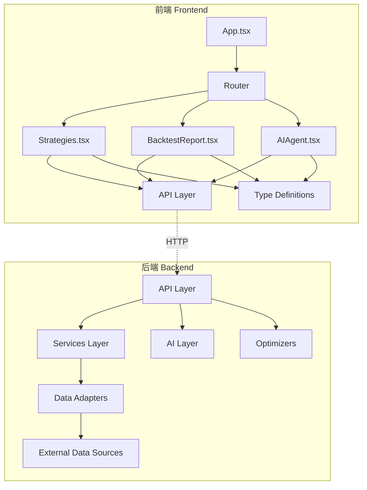
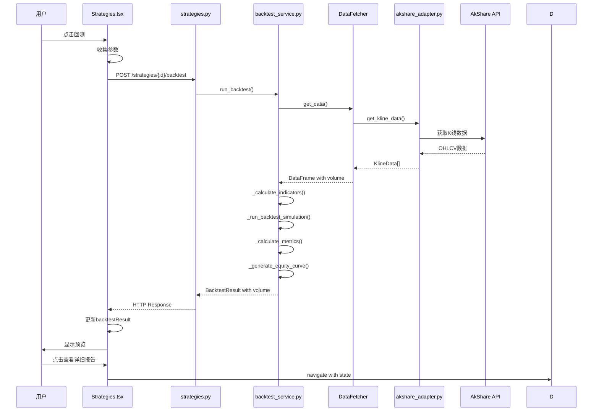
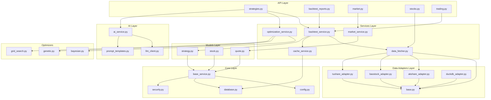
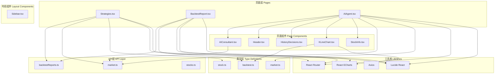
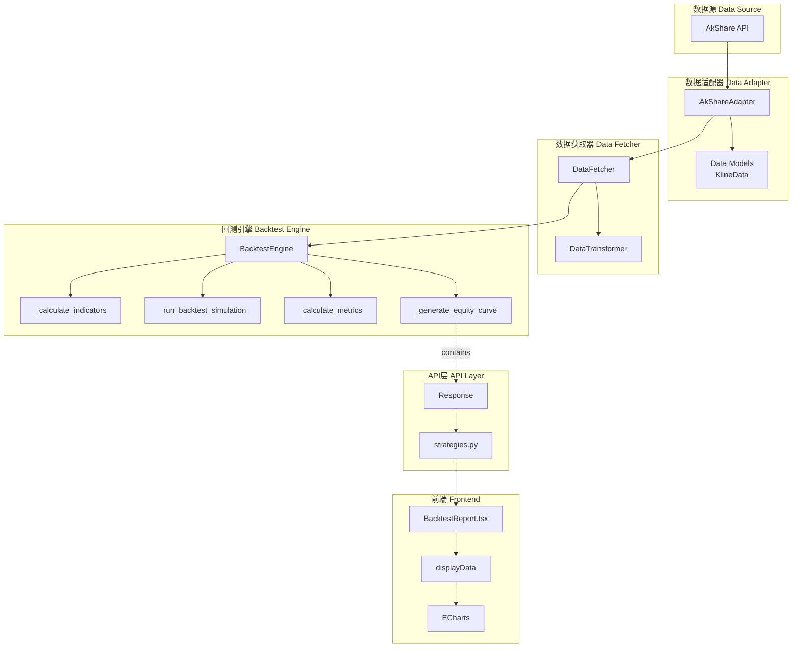
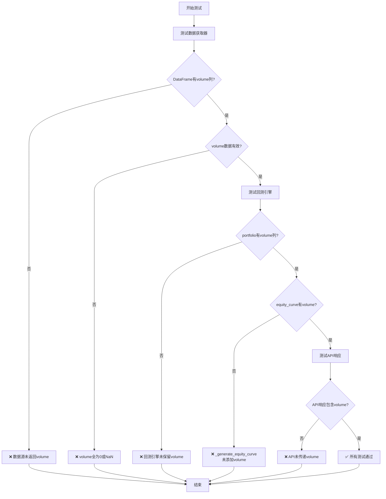
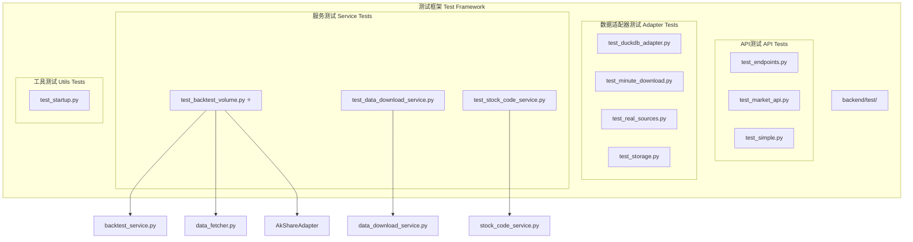
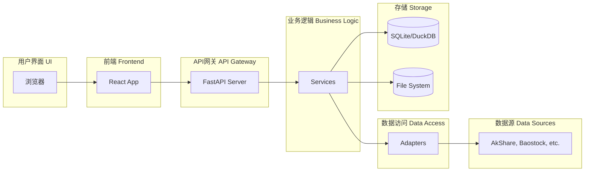

# 组件依赖关系图

本文档使用Mermaid图表展示系统的组件依赖关系。

## 系统整体架构



## 回测流程详细依赖图



## 回测报告文件管理流程

```mermaid
graph LR
    subgraph "保存流程"
        A[用户点击保存] --> B[saveBacktestReport]
        B --> C[POST /backtest-reports]
        C --> D[backtest_reports.py]
        D --> E[生成文件名]
        E --> F[保存JSON文件]
        F --> G[返回元数据]
        G --> H[刷新列表]
    end
    
    subgraph "加载流程"
        I[用户选择报告] --> J[loadBacktestReport]
        J --> K[GET /backtest-reports/{filename}]
        K --> L[backtest_reports.py]
        L --> M[读取文件]
        M --> N[返回报告数据]
        N --> O[更新displayData]
        O --> P[重新渲染图表]
    end
    
    subgraph "删除流程"
        Q[用户点击删除] --> R[deleteBacktestReport]
        R --> S[DELETE /backtest-reports/{filename}]
        S --> T[backtest_reports.py]
        T --> U[删除文件]
        U --> V[刷新列表]
    end
```

## 后端分层架构依赖图



## 前端组件依赖图



## 数据流转图 - 回测成交量数据



## 成交量数据验证流程



## 测试框架结构图



## 完整系统依赖关系（简化版）



## 模块依赖关系矩阵

| 模块 | API | Services | Adapters | Models | Core | Frontend | 测试 |
|------|-----|----------|----------|--------|------|----------|------|
| API Layer | - | ✓ | - | ✓ | ✓ | - | ✓ |
| Services Layer | ✓ | - | ✓ | ✓ | - | - | ✓ |
| Data Adapters | - | ✓ | - | ✓ | - | - | ✓ |
| Models | ✓ | ✓ | ✓ | - | - | - | ✓ |
| Core | - | ✓ | ✓ | ✓ | - | - | ✓ |
| Frontend | ✓ | - | - | - | - | - | - |
| 测试 | ✓ | ✓ | ✓ | ✓ | ✓ | - | - |

图例：
- ✓ 表示有依赖关系
- - 表示无直接依赖

## 使用说明

### 在GitHub上查看

Mermaid图表在GitHub上会自动渲染，直接查看此文件即可。

### 在本地预览

1. 安装VS Code的Mermaid插件
2. 或使用在线预览工具：https://mermaid.live/
3. 复制Mermaid代码块到编辑器中预览

### 生成图片

```bash
# 安装mermaid-cli
npm install -g @mermaid-js/mermaid-cli

# 生成PNG图片
mmdc -i COMPONENT_DEPENDENCY_GRAPH.md -o dependency-graph.png

# 生成SVG图片
mmdc -i COMPONENT_DEPENDENCY_GRAPH.md -o dependency-graph.svg
```

---

**文档版本**: 1.0  
**最后更新**: 2026-02-17  
**维护者**: 开发团队